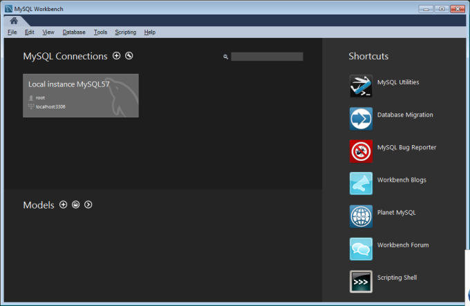
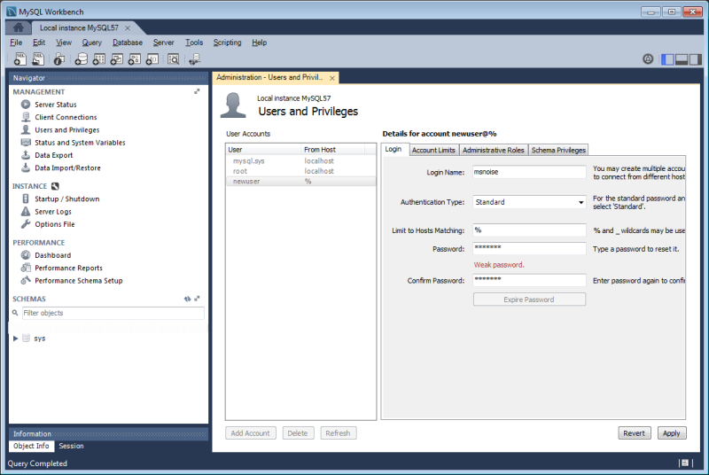
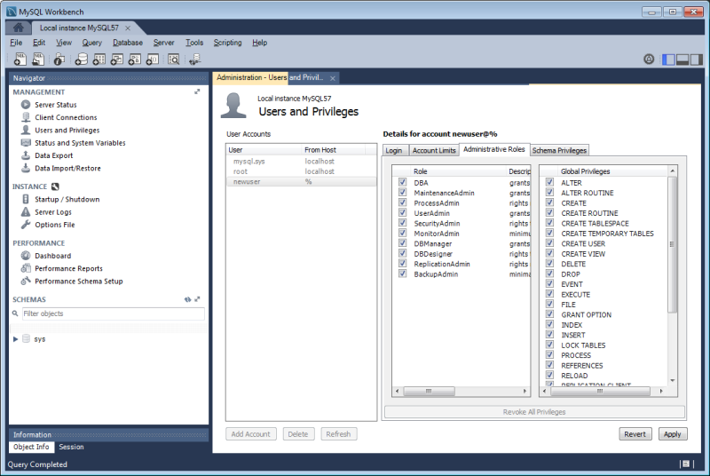
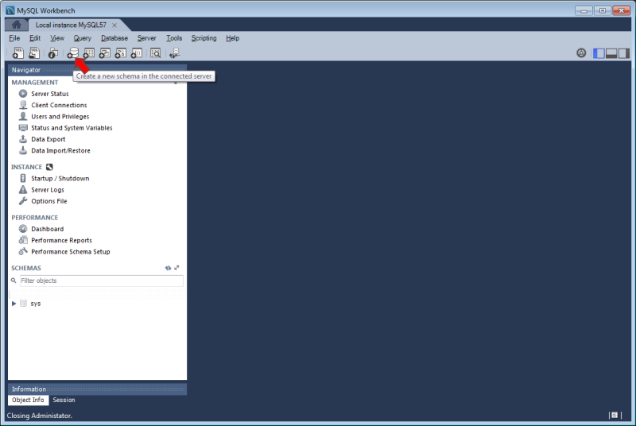
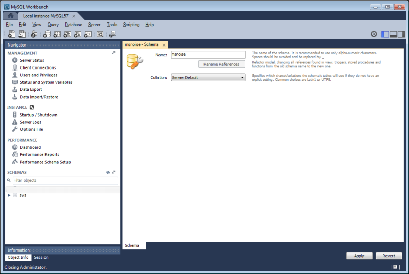
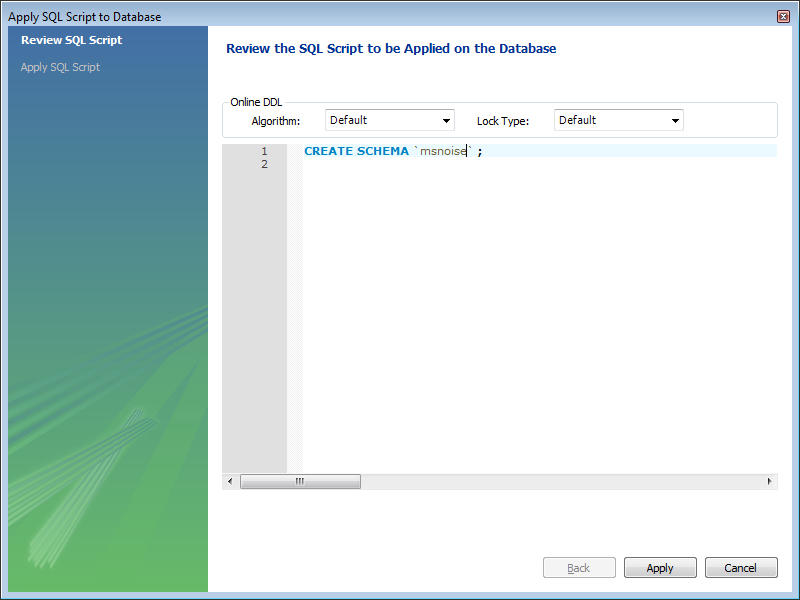
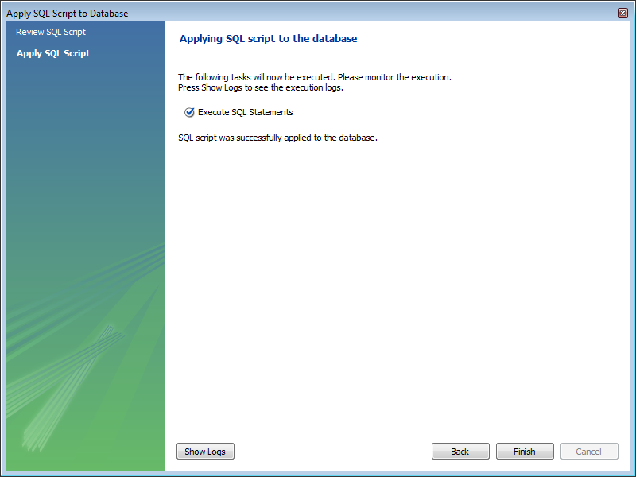
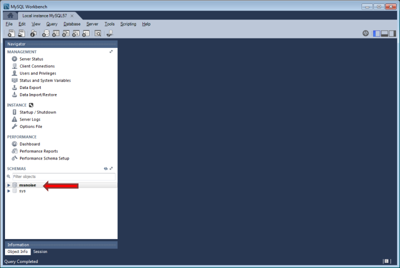

.. _installation:

******************************
Installation
******************************

MSNoise is a python package that uses a database (sqlite or MySQL) for storing
station and files metadata together with jobs. When installed, it provides a top
level command ``msnoise`` in the console.

Note that MSNoise is always tested against the latest release versions of the main packages, so older installations that are not maintained/updated regularly (years) could encounter issues. Please make sure you have the latest version of Numpy and Scipy (and MKL), as performance gets better and better (especially since Anaconda Inc. released its fast MKL implementations for all users, in the conda-forge channel).

To run MSNoise, you need:

* A recent version of Python (3.x recommended). We suggest using Anaconda_
  with a few extra modules. MSNoise is tested "continuously" by automatic
  build systems (GitHub Actions) **Python 3.9+** only,
  on **Windows, Linux and MacOSX** 64 bits systems!

  * Those modules are already distributed with Anaconda_:

    * setuptools
    * numpy
    * scipy
    * pandas
    * matplotlib
    * statsmodels
    * sqlalchemy
    * click
    * flask
    * pymysql
    * wtforms

  * Not shipped with Anaconda_:

    * obspy
    * flask-admin
    * markdown
    * folium
    * flask-wtf


* MySQL: if you want to use MySQL, you need to install and configure a
  MySQL Server beforehand. This is not needed for sqlite.
  Read :ref:`aboutdbandperformances` for more information.
  We recommend using MySQL.


Full Installation
-----------------

1. Download and install Anaconda_ for your machine, make sure Anaconda's Python
   is the default python for your user

2. Execute the following command to install the missing packages:
   
   .. code-block:: sh

        conda install -c conda-forge flask-admin flask-wtf markdown folium pymysql logbook
        conda install -c conda-forge obspy

3. Install a MySQL server and MySQL Workbench:

   Download and install MySQL Community Server (MySQLs_ ) and MySQL Workbench
   (MySQLw_ ) ; On Windows one can also use the MySQL installer (MySQLi_ ).

   On Linux, the MySQL server can also be installed using the following command:

   .. code-block:: sh

       sudo apt-get install mysql-server

4. Create a privileged user and a database:

   * Start MySQL Workbench and connect to the local database
   * Click on "Privileges" and create a new user, with all privileges (Select
     all). Ideally, create user "msnoise" with password "msnoise".

5. Install the latest release version of MSNoise:

   .. code-block:: sh

        pip install msnoise

   Power user could install the development version too, but it is not
   recommended.

6. Check which required packages you are still missing by executing the
   ``msnoise bugreport`` command. (See :ref:`testing`)

7. To be sure all is running OK, one could start the ``msnoise test`` command.
   This will start the standard MSNoise test suite, which should end with a
   "Ran xx tests in yy seconds : OK".

8. Proceed to the :ref:`Workflow` description to start MSNoise!

Done !

MySQL Server and Workbench
--------------------------

Using the MySQL Server and Workbench is fairly easy and lots of tutorials are
available online as text or videos.

Once both are installed, start Workbench and you should see the local MySQL
server automatically identified:



And by clicking on "Local Instance ..." another tab should open, connected to
the local database.

Create a msnoise user
~~~~~~~~~~~~~~~~~~~~~

Select "Users and Privileges" in the left sidebar, then "Add Account". Define
the username and the password (msnoise:msnoise could do, although "weak"):



Then, under "Administrative Roles", grant this user the *DBA* mode (user can
perform all tasks on the database server) and click "Apply".




.. _emptydb:

Create an empty database
~~~~~~~~~~~~~~~~~~~~~~~~

Ideally, each "project" needs a database. For example, if one has two different
volcanoes and wants to run MSNoise using the these distinct datasets, one needs
to create two empty databases. For users who have access to only 1 database,
the ```msnoise db init`` allows to provide a ``prefix```, which works like the
Wordpress prefixes: for example if a prefix is "vA", the ```config`` 
table that will be created is ``vA_config`` in the database.

Click on the "Create new schema" button in the taskbar:



and provide a name for the database (for example msnoise; or msnoise_project1,
or project1, or anything else) ; and click "Apply":



and click "Apply" again and it should state all is OK:





When done, the database we can be seen in the left sidebar:



And you're ready to start your first project: :ref:`Workflow`.


When moving your project to a larger server, HPC or else, just add the
connection to this server in Workbench and you're good to go with the very
same interface/tool !

MySQL/MariaDB configuration
---------------------------

.. warning:: THIS SHOULD NOT BE necessary with current MASTER version (msnoise2)

You can also set up a database server using MariaDB_, there are plenty tutorials
of how to set it up as well. The new default character set for MySQL or 
MariaDB is not simple utf8, so make sure that the configuration file
(/etc/mysql/my.cnf under Linux) contains the following lines. There are 
issues with the latest MySQL versions which prevent a "traditional group by"
statement.

.. code-block:: sh

    [mysqld]
    character-set-server=utf8
    collation-server=utf8_unicode_ci
    sql_mode="TRADITIONAL,NO_AUTO_CREATE_USER"


For Mac, this seemed to work for users (see Issue72_):

.. code-block:: sh

    [mysqld]
     sql_mode=STRICT_TRANS_TABLES,NO_ZERO_IN_DATE,NO_ZERO_DATE,ERROR_FOR_DIVISION_BY_ZERO,NO_AUTO_CREATE_USER,NO_ENGINE_SUBSTITUTION


Database Structure - Tables
----------------------------
MSNoise will create the tables automatically upon running the installer script
(see :ref:`Workflow`).


Building this documentation
---------------------------

To build this documentation, some modules are required:

.. code-block:: sh

    conda install -c conda-forge "sphinx<6" sphinx_bootstrap_theme numpydoc sphinx-gallery
    pip install "sphinx_rtd_theme>1"


Then, this should simply work:

.. code-block:: sh

    make html
    
it will create a .build folder containing the documentation.

You can also build the doc to Latex and then use your favorite Latex-to-PDF
tool.


Using the development version
-----------------------------

This is not recommended, but users willing to test the latest development
(hopefully stable) version of MSNoise can:

.. code-block:: sh

    pip uninstall msnoise
    pip install http://msnoise.org/master.zip

Please note this version most probably uses the very latest version of every
package: Release versions of `numpy`, `scipy`, etc obtained from conda-forge
and "master" version of `obspy`. The development version (master) of obspy can
be installed from github:

.. code-block:: sh

    pip uninstall obspy
    pip install https://github.com/obspy/obspy/archive/master.zip

If you are using the master version, please use the issue tracker of github to
communicate about bugs and not the mailing list, preferably used for Releases.


.. _obspy: http://www.obspy.org
.. _Anaconda: http://www.continuum.io/downloads
.. _MySQLi: https://dev.mysql.com/downloads/installer
.. _MySQLs: https://dev.mysql.com/downloads/mysql
.. _MySQLw: https://dev.mysql.com/downloads/workbench
.. _MariaDB: https://mariadb.org
.. _Issue72: https://github.com/ROBelgium/MSNoise/issues/72