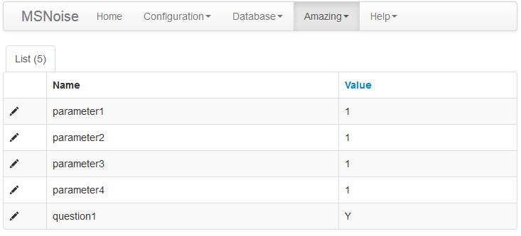
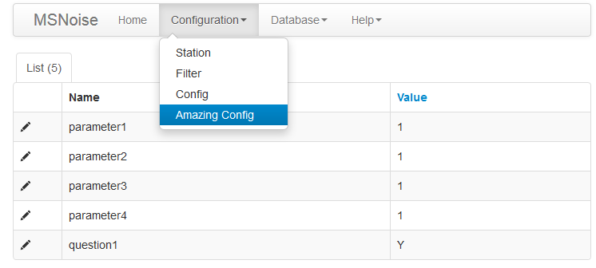

.. include:: configs.hrst

******************************
Extending MSNoise with Plugins
******************************

.. versionadded:: 1.4

Starting with :doc:`releasenotes/msnoise-1.4`, MSNoise supports Plugins, this
means the default workflow "from archive to dv/v" can be branched at any step!

.. contents::
    :local:

What is a Plugin and how to declare it in MSNoise
-------------------------------------------------

A plugin is a python package, properly structured, that can be imported from
msnoise, i.e. it has to be "installed" like any other python package.

After installing a plugin, its **package name** must be declared in the
``plugins`` parameter in the configuration. This must be done **PER PROJECT**.
This configuration field supports a list of plugins, separated by a simple comma
(!no space), e.g. ``msnoise_amazing,msnoise_plugin101``.

Once configured in a project, the plugin should appear when calling the
``msnoise plugin`` command:

.. code-block:: sh

    $ msnoise plugin

      Usage: msnoise-script.py plugin [OPTIONS] COMMAND [ARGS]...

      Runs a command in a named plugin

    Options:
      --help  Show this message and exit.

    Commands:
      amazing  Example Amazing Plugin for MSNoise

Plugin minimal structure
------------------------

A plugin is a python package, so its minimal structure is:

.. code-block:: sh

    msnoise-amazingplugin
    ├── __init__.py
    ├── setup.py
    └── msnoise_amazingplugin
        ├── __init__.py
        └── plugin_definition.py

The ``setup.py`` declares where the plugin actually hooks into MSNoise:

.. code-block:: python

    from setuptools import setup, find_packages

    setup(
        name='msnoise_amazing',
        version='0.1a',
        packages=find_packages(),
        include_package_data=True,
        install_requires=['msnoise',
                          'obspy'],
        entry_points = {
            'msnoise.plugins.commands': [
                'amazing = msnoise_amazing.plugin_definition:amazing',
                ],
            },
        author = "Thomas Lecocq & MSNoise dev team",
        author_email = "Thomas.Lecocq@seismology.be",
        description = "An example plugin",
        license = "EUPL-1.1",
        url = "http://www.msnoise.org",
        keywords="amazing seismology"
    )

The most important line of this file is the one declaring the ``amazing`` entry
point in ``msnoise.plugins.commands`` and linking it to the plugin's
``plugin_definition.py`` file.

The content of ``plugin_definition.py`` must then provide at least one
:class:`click.Command`, or more commonly, one :class:`click.Group` and
many :class:`click.Command`.

.. code-block:: python

    import click

    @click.group()
    def amazing():
        """Example Amazing Plugin for MSNoise"""
        pass

    @click.command()
    def sayhi():
        """A Very Polite Command"""
        print("Hi")

    amazing.add_command(sayhi)

This way, once properly installed and activated (declared in the ``plugins``
config), the plugin will be callable from msnoise:

.. code-block:: sh

    $ msnoise plugin amazing

      Usage: msnoise-script.py plugin amazing [OPTIONS] COMMAND [ARGS]...

      Example Amazing Plugin for MSNoise

    Options:
      --help  Show this message and exit.

    Commands:
      sayhi  A Very Polite Command

and its command too:

.. code-block:: sh

    $ msnoise plugin amazing sayhi

    Hi

Amazing, isn't it ?

Declaring Job Types - Hooking
-----------------------------

Plugin-based job types are defined by providing a ``register_job_types`` method
in ``plugin_definition.py``. A new job type is defined with two parameters:

* ``name``: the actual job name (acronym style) used all over (example: CC2, TEST)
* ``after``: when is this job added to the database.

Current supported "after" are:

* ``new_files``: will be created when running the ``new_jobs`` command and will
  create a job with those parameters (nf is a new file identified in the
  scan_archive procedure). In this specific case, the ``pair`` field of the job
  will only be NET.STA, not a "pair". A job will only be inserted if the station
  is "Used" in the configuration.

  .. code-block:: python

        all_jobs.append({"day": current_date, "pair": "%s.%s"%(nf.net,nf.sta),
                         "jobtype": jobtype, "flag": "T",
                         "lastmod": datetime.datetime.utcnow()})

* ``scan_archive``: will be created when running the ``new_jobs`` command, in
  parallel to ``CC`` jobs. This is, for example, useful when one wants to
  compute relative amplitude ratios between station pairs. In this case, the
  ``pair`` field of the job is set to the pair name.

* ``refstack``: will be created when running the ``stack`` command and when
  a new REF stack needed to be calculated. This is, for example, useful when one
  wants to work on the REF stacks using a Ambient Seismic Noise Tomography code.

Plugin's Job Types are first declared in ``setup.py`` (in Entry Points):

.. code-block:: python

    'msnoise.plugins.jobtypes': [
    'register = msnoise_amazing.plugin_definition:register_job_types',
    ],

.. code-block:: python

    def register_job_types():
        jobtypes = []
        jobtypes.append( {"name":"AMAZ1", "after":"new_files"} )
        return jobtypes

Then, adding a ``compute`` command to the ``plugin_definition.py``:

.. code-block:: python

    @click.command()
    def compute():
        """Compute an Amazing Value"""
        from .compute import main()
        main()

    amazing.add_command(compute)

and creating a  ``compute.py`` file in the plugin folder:

.. code-block:: python

    import os
    from obspy.core import UTCDateTime, read

    from msnoise.api import connect, is_next_job, get_next_job, \
        get_data_availability, get_config, update_job

    def main():
        db = connect()
        while is_next_job(db, jobtype='AMAZ1'):
            jobs = get_next_job(db, jobtype='AMAZ1')
            for job in jobs:
                net, sta = job.pair.split('.')
                gd = UTCDateTime(job.day).datetime
                print("Processing %s.%s for day %s"%(net,sta, job.day))
                files = get_data_availability(
                        db, net=net, sta=sta, starttime=gd, endtime=gd,
                        comp="Z")
                for file in files:
                    fn = os.path.join(file.path, file.file)
                    st = read(fn, starttime=UTCDateTime(job.day), endtime=UTCDateTime(job.day)+86400)
                    print(st)

Aaaand:

.. code-block:: sh

    $ msnoise plugin amazing compute

    Processing YA.UV05 for day 2010-09-01
    1 Trace(s) in Stream:
    YA.UV05.00.HHZ | 2010-09-01T00:00:00.000000Z - 2010-09-01T23:59:59.990000Z | 100.0 Hz, 8640000 samples
    Processing YA.UV06 for day 2010-09-01
    1 Trace(s) in Stream:
    YA.UV06.00.HHZ | 2010-09-01T00:00:00.000000Z - 2010-09-01T23:59:59.990000Z | 100.0 Hz, 8640000 samples
    Processing YA.UV10 for day 2010-09-01
    1 Trace(s) in Stream:
    YA.UV10.00.HHZ | 2010-09-01T00:00:00.000000Z - 2010-09-01T23:59:59.990000Z | 100.0 Hz, 8640000 samples

Provided you have reset the DataAvailability rows with a "M" or "N" flag so that
when you ran ``new_jobs`` it actually inserted the ``AMAZ1`` jobs !

Because job-based stuff always requires a lot of trial-and-error, remember that
the ``msnoise reset`` command is your best friend. In this example, we would
need to ``msnoise reset AMAZ1`` to reset "I"n Progress jobs, or
``msnoise reset AMAZ1 --all`` to reset all ``AMAZ1`` jobs to "T"o Do.

.. note::

    * Currently, not all MSNoise workflow steps use the ``is_next_job`` -
      ``get_next_job`` logic, but it'll be the case for MSNoise 1.5

    * Only three hooks are currently present, of course, more will be added in
      in the future.

Plugin's own config table
-------------------------

Plugins can create a new table in the database, e.g. in an ``install`` command.
First, a ``amazing_table_def.py`` table definition file must be created:

.. code-block:: python

    # Table definitions for Amazing
    from sqlalchemy import Column, String
    from sqlalchemy.ext.declarative import declarative_base

    Base = declarative_base()

    class AmazingConfig(Base):
        """
        Config Object

        :type name: str
        :param name: The name of the config bit to set.

        :type value: str
        :param value: The value of parameter `name`
        """
        __tablename__ = "amazing-config"
        name = Column(String(255), primary_key=True)
        value = Column(String(255))

        def __init__(self, name, value):
            """"""
            self.name = name
            self.value = value

and a ``default.py`` file containing the parameters names, explanation and
default value:

.. code-block:: python

    from collections import OrderedDict
    default = OrderedDict()

    default['parameter1'] = ["Some really useful text",'1']
    default['parameter2'] = ["Some really useful text",'1']
    default['parameter3'] = ["Some really useful text",'1']
    default['parameter4'] = ["Some really useful text",'1']

    default['question1'] = ["Is this a useful text [Y]/N",'Y']

Then, the ``install.py`` file contains the method to add this table to the
database:

.. code-block:: python

    from msnoise.api import *

    from .amazing_table_def import AmazingConfig
    from .default import default

    def main():
        engine = get_engine()
        Session = sessionmaker(bind=engine)
        session = Session()

        AmazingConfig.__table__.create(bind=engine, checkfirst=True)
        for name in default.keys():
            session.add(AmazingConfig(name=name,value=default[name][-1]))

        session.commit()

then add the command to the ``plugin_definition.py``:

.. code-block:: python

    @click.command()
    def install():
        """ Create the Config table"""
        from .install import main
        main()

    amazing.add_command(install)

When all this is prepared, running the ``msnoise plugin amazing install``
command will connect to the current database, create the `amazing-config` table
and add the parameters names and their default value.

An entry point to the ``setup.py`` file has to be defined in order to access
Plugin's config tables via the msnoise api :func:`msnoise.api.get_config` method:

.. code-block:: python

    'msnoise.plugins.table_def': [
            'AmazingConfig = msnoise_amazing.amazing_table_def:AmazingConfig',
        ],

Then, running a simple python command:

.. code-block:: python

    from msnoise.api import connect, get_config

    db = connect()
    print(get_config(db, "parameter1", plugin="Amazing"))
    print(get_config(db, "parameter2", plugin="Amazing"))
    print(get_config(db, "parameter3", plugin="Amazing"))
    print(get_config(db, "parameter4", plugin="Amazing"))
    print(get_config(db, "question1", plugin="Amazing", isbool=True))

should print:

.. code-block:: sh

    1
    1
    1
    1
    True

Adding Web Admin Pages
----------------------

Plugins can also declare new pages to the Web Admin ! This is simply done by,
againg, declaring some entry points in ``setup.py``:

.. code-block:: python

    'msnoise.plugins.admin_view': [
            'AmazingConfigView = msnoise_amazing.plugin_definition:AmazingConfigView',
            ],

and the corresponding object in ``plugin_definition.py``:

.. code-block:: python

    from flask.ext.admin.contrib.sqla import ModelView
    from .amazing_table_def import AmazingConfig

    class AmazingConfigView(ModelView):
        # Disable model creation
        view_title = "MSNoise Amazing Configuration"
        name = "Configuration"

        can_create = False
        can_delete = False
        page_size = 50
        # Override displayed fields
        column_list = ('name', 'value')

        def __init__(self, session, **kwargs):
            # You can pass name and other parameters if you want to
            super(AmazingConfigView, self).__init__(AmazingConfig, session,
                                                    endpoint="amazingconfig",
                                                    name="Config",
                                                    category="Amazing", **kwargs)

Then (as always, after re-developing/installing the package), the magic occurs:

Or, changing the last 4 lines of the previous code to:

.. code-block:: python

    super(AmazingConfigView, self).__init__(AmazingConfig, session,
                                            endpoint="amazingconfig",
                                            name="Amazing Config",
                                            category="Configuration", **kwargs)

Uninstalling Plugins
--------------------

Plugins can be de-activated by removing their package name from the ``plugins``
configuration parameter. Ideally, plugins should provide an ``uninstall``
command similar to the ``install`` to take care of deleting/dropping the tables
in the project database.

Download Amazing Plugin
-----------------------

That's cheating, you know ? :-)

`Download the Amazing Plugin <https://github.com/ROBelgium/msnoise-amazing>`_

