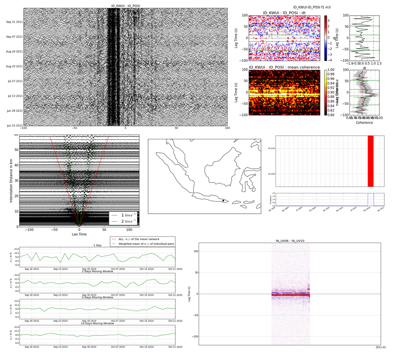

.. include:: ../configs.hrst

MSNoise 1.3
=============

Release date: 20 March 2015

Release type: major

Release notes:

.. contents::
    :local:

Introduction
------------

8 months after the last bugfix release (:doc:`msnoise-1.2.5`), and
17 months after the last major release (:doc:`msnoise-1.2`) we are
proud to announce the new :doc:`msnoise-1.3`.
It is a **major** release, with a massive amount of work since the
last release: in `GitHub numbers <https://github.com/ROBelgium/MSNoise/graphs/contributors?from=2014-06-28&to=2015-03-19&type=c>`_
, it's over 100 commits and about 3500 new lines of code and documentation
added ! MSNoise 1.3 introduces a **brand new** way of executing the
workflow. The workflow in itself doesn't change, so experienced users as well as
new users reading the SRL publication will find their way easily!

**MSNoise is now a Python Package**, allowing a single (and easy) install for
all your projects and/or all users using ``pip``. The new top-level ``msnoise``
command contains all the steps of the workflow, plus new additions, as the very
useful ``reset`` command to easily mark all jobs "T"odo. The ``msnoise plot``
command group which includes seven plots, all directly callable from the command
line, without needing to hack/edit the source codes. About hacking: MSNoise has
now a proper documented API which allows pythonistas to write their own plots,
computation steps, ..., while interacting with the database and the data
archive! The "dynamic time lag" allows to use parts of the coda that is
dependent from the interstation distance (provided station coordinates are
defined).
Finally, MSNoise is now *tested* and automatically checked by Travis-CI!

This version has benefited from outputs/ideas/pull requests/questions from
several users:

* Rebecca Kramer
* Carmelo Sammarco
* Oscar Alberto Castro Artola
* Kasper van Wijk
* Kohtaro R. Araragi
* Esteban Chaves
* Adrian Shelley
* Weston Thelen
* Robert Abbott
* Jean Battaglia
* Sébastien Carniato
* Xiao Wang
* Lion Krisher
* Tobias Megies
* all participants to the 2014 Pre-AGU MSNoise workshop
* all others (don't be mad :-) )

Thanks to all for using MSNoise, and please, let us know why/how you use it
(and please cite it!)!

*Thomas Lecocq & Corentin Caudron*

~~~~

PS: if you use MSNoise for your research and prepare publications, please
consider citing it:

**Lecocq, T., C. Caudron, et F. Brenguier (2014)**, MSNoise, a Python Package
for Monitoring Seismic Velocity Changes Using Ambient Seismic Noise,
*Seismological Research Letters*, 85(3), 715‑726, doi:10.1785/0220130073.

MSNoise is a real Python Package
--------------------------------

This is probably the most important change since the original release of
MSNoise 1.0 (August 2013), it represents a massive amount of work since the
last release (1.2.5 in June 2014), and is probably the most needed by users!
In  `GitHub numbers <https://github.com/ROBelgium/MSNoise/graphs/contributors?from=2014-06-28&to=2015-03-19&type=c>`_
, it's over 100 commits and about 3500 new lines of code (and of documentation!)
added !

In practice, what does change ?

* MSNoise is installable using ``pip`` or ``easy_install``, soon using ``conda``
* MSNoise is installed in the common "site-package/" folder of one's python
  install.
* Once installed, it is available for all users, all projects.
* It allows updating MSNoise for all projects at once.
* It removes all python files from project folders, which is much cleaner.

MSNoise being installed in the standard lib directories means it shouldn't
write or output anything in those folders. To facilitate the launch of commnands
a new top level ``msnoise`` command has been created, and should be available
right after installing.

``msnoise`` is now a top-level command
--------------------------------------

Users of MSNoise will have to change the way they call the steps, i.e.:

* ``python s000_installer.py``  becomes ``msnoise install``
* ``python s001_configurator.py``  becomes ``msnoise config``
* ``python s002_populate_station_table.py``  becomes ``msnoise populate``
* ``python s01_scan_archive.py`` becomes ``msnoise scan_archive``
* ``python s02_new_jobs.py`` becomes ``msnoise new_jobs``
* ``python s03_compute_cc.py`` becomes ``msnoise compute_cc``
* ``python s04_stack.py`` becomes ``msnoise stack``
* ``python s05_compute_mwcs.py`` becomes ``msnoise compute_mwcs``
* ``python s06_compute_dtt.py`` becomes ``msnoise compute_dtt``

All the commands are visible using the ``--help`` argument:

.. code-block:: sh

    msnoise --help

    Usage: msnoise-script.py [OPTIONS] COMMAND [ARGS]...

    Options:
      -t, --threads INTEGER  Number of threads to use (only affects modules that
                             are designed to do parallel processing)
      --help                 Show this message and exit.

    Commands:
      bugreport           This command launches the Bug Report script.
      compute_cc          Computes the CC jobs (based on the "New Jobs"...
      compute_dtt         Computes the dt/t jobs based on the new MWCS...
      compute_mwcs        Computes the MWCS based on the new stacked...
      compute_stretching  [experimental] Computes the stretching based...
      config              This command launches the Configurator.
      info                Outputs general information about the current...
      install             This command launches the installer.
      ipython             Launches an ipython notebook in the current...
      new_jobs            Determines if new CC jobs are to be defined
      plot                Top level command to trigger different plots
      populate            Rapidly scan the archive filenames and find...
      reset               Resets the job to "T"odo.
      scan_archive        Scan the archive and insert into the Data...
      stack               Stacks the [REF] and/or [MOV] windows
      test                Runs the test suite, should be executed in an...
      upgrade_db          Upgrade the database from pre-1.3 to MSNoise...

The parameters/arguments of each command are explained using its own ``--help``
, for example:

.. code-block:: sh

    msnoise reset --help

    Usage: msnoise-script.py reset [OPTIONS] JOBTYPE

      Resets the job to "T"odo. ARG is [CC] or [DTT]. By default only resets
      jobs "I"n progress. --all resets all jobs, whatever the flag value

    Options:
      -a, --all  Reset all jobs
      --help     Show this message and exit.

The description of each step has been updated in the documentation.

``msnoise plot``: Plotting made easy
---------------------------------------
As explained above, ``msnoise`` is a top level command available in your
command prompt. MSNoise 1.3 includes several plots which are available using the
``msnoise plot`` command. See :doc:`../plotting` to view all plots!

All the available plots are listed using the ``--help`` argument:

.. code-block:: sh

    msnoise plot --help

    Usage: msnoise-script.py plot [OPTIONS] COMMAND [ARGS]...

      Top level command to trigger different plots

    Options:
      --help  Show this message and exit.

    Commands:
      ccftime            Plots the dv/v (parses the dt/t results)
      data_availability  Plots the Data Availability vs time
      distance           Plots the REFs of all pairs vs distance
      dvv                Plots the dv/v (parses the dt/t results)
      interferogram      Plots the interferogram between sta1 and sta2...
      mwcs               Plots the mwcs results between sta1 and sta2...
      station_map        Plots the station map (very basic)

Same as above, sub-commands have their own ``--help``:

.. include:: ../clickhelp/msnoise-cc-plot-interferogram.rst

New functionality: Dynamic time lags
------------------------------------
As before, the dt/t is determined as the slope of the delays vs time lags.
the slope is calculated a weighted linear regression (WLS) through selected
points.
The selection of points is first based on the time lag criteria.
The minimum time lag can either be defined absolutely or dynamically.
When ``dtt_lag`` is set to "dynamic" in the database, the inter-station
distance is used to determine the minimum time lag. This lag is calculated from
the distance and a velocity configured (``dtt_v``). The velocity is determined
by the user so that the minlag doesn't include the ballistic waves. For example
if ballistic waves are visible with a velocity of 2 km/s, one could configure
dtt_v=1.0.
This way, if stations are located 15 km apart, the minimum lag time will be
set to 15 s. The ``dtt_width`` determines the width of the lag window used. A
value of 30.0 means the process will use time lags between 15 and 45 s in the
example above, on both sides if configured (``dtt_sides``), or only causal or
acausal parts of the CCF.

.. note:: It seems obvious that these parameters are frequency-dependent, but
    they are currently common for all filters !

New parameters have been added to the configuration:

* |dtt_lag|
* |dtt_v|
* |dtt_minlag|
* |dtt_width|
* |dtt_sides|
* |dtt_mincoh|
* |dtt_maxerr|
* |dtt_maxdt|

.. seealso:: The description of the :ref:`workflowcomputedtt` step in the
   workflow.

Math updates & bugfixes
-----------------------
Some improvements to the maths have been done for MSNoise 1.3:

* ``whiten``: the symmetric hermitian was not properly defined and could lead to
  a 1 sample shift in the negative frequencies.
* ``compute_cc``: it is now possible to define an overlap of the windows
* ``compute_cc``: setting ``windsorizing`` to ``-1`` now computes the 1-bit
  normalization of the trace. Reminder: ``0``: no normalization, ``N``: N*rms
  clipping.
* ``mwcs``: the tapering of the windowed CCF has been improved in order to
  optimize the calculation for the center of the window.

Performance improvements
------------------------
Improvements in terms of performances have also been done for MSNoise 1.3:

* ``new_jobs``: the procedure has been completely rewritten and should be a lot
  faster, certainly for large (to very-large) archives and/or number of days.
* ``keep_all``: if set to ``Y`` (=True) in the config, all CCF are now stored in
  a single HDF5 file, which makes it much nicer to backup/transfer/delete.
* ``compute_cc``: if only ZZ components are to be computed, the whitened windows
  are pre-computed, which makes the process faster. This could lead to memory
  issues if the job contains a lot of stations, a lot of filters are configured
  and a large number of windows.
* ``compute_mwcs``: The procedure updates the jobs all at once, which brings a
  big gain in transaction time.

MSNoise has a proper API: Hacking MSNoise
------------------------------------------
The former ``database_tools.py`` has been renamed to ``api.py`` and all the
functions are now documented (in :doc:`../api`) so they can be used from the
console or from custom scripts.

Using the ``msnoise ipython`` command, one triggers the start of an IPython
notebook in the current project folder. Once in a new notebook, one could

.. code-block:: python

    from msnoise.api import connect, get_config
    session = connect()
    print get_config(session, "mov_stack")

to get the current configuration of the ``mov_stack`` parameter ! Enjoy Hacking!

MSNoise is tested
-----------------
UnitTests are now defined for some (not all, yet) MSNoise functions, and most of
the workflow is tested automatically by launching ``msnoise test`` in a new
folder.

This will allow contributors to easily know the code they want to be merged in
the next versions of MSNoise doesn't break anything.
`Travis-CI <https://travis-ci.org/ROBelgium/MSNoise>`_ runs automatically on
every push or pull request made on GitHub.

.. _upgradingto13:

Upgrading an existing project to MSNoise 1.3
--------------------------------------------

Some users will want to keep their current project without recomputing
everything. This requires:

1. adding a few configuration parameters to the database
2. modifying the structure of the ``jobs`` table.

Running the following command will do both parts for MySQL and only the first
part for SQLite:

.. code-block:: sh

    msnoise upgrade_db

The second part is a little different if you are using SQLite as it
can't be done automatically. This is because SQLite doesn't support "ALTER"
commands. Ultimately we want the ``jobs.type`` to be renamed to
``jobs.jobtype``. You will have to do this operation manually:

* Open SQLite database browser (`SQLiteManager <https://addons.mozilla.org/firefox/addon/sqlite-manager/>`_
  extension for Firefox, for example)
* Open the msnoise.sqlite file
* Select the jobs table
* Edit the ``type`` field and rename it to ``jobtype``
* Ignore the warnings (it should work, although it could fail!)
* Close the database

A note on parallel processing
-----------------------------
Although the ``msnoise`` command accepts the
``-t INTEGER`` argument to launch a number of threads in parallel, it currently
only works with ``scan_archive``: ``msnoise -t 4 scan_archive`` will run the
scan on four folders in parallel. For the other steps, one has still to run
multiple commands in a console. This should change in the future.
