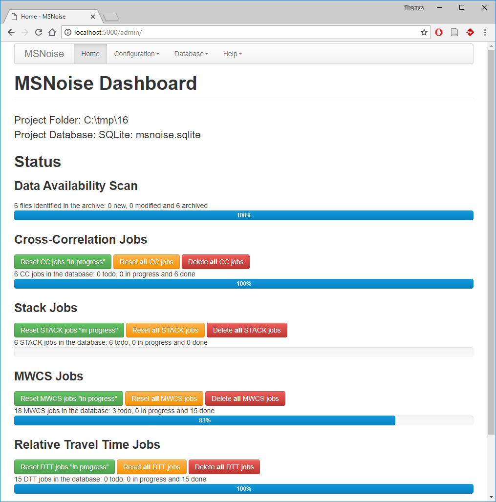
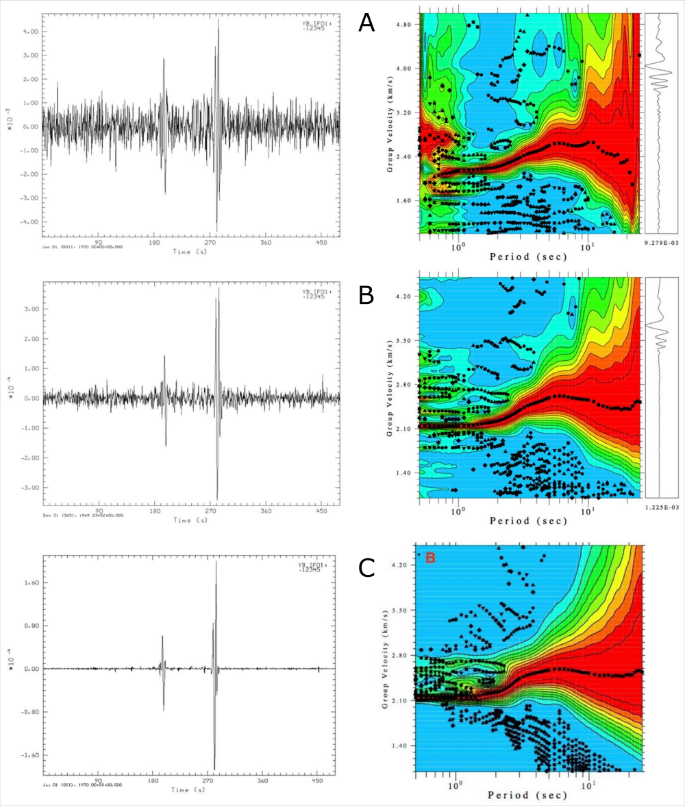

.. include:: ../configs.hrst

MSNoise 1.4
=============

Release date: XX XXXXXX 2016

Release type: major

Release notes:

.. contents::
    :local:

Introduction
------------
Just over a year after the last major release (:doc:`msnoise-1.3`) we are proud
to announce the new :doc:`msnoise-1.4`. It is a **major** release, with a
massive amount of work since the last one: in `GitHub numbers
<https://github.com/ROBelgium/MSNoise/graphs/contributors?from=2015-04-01&to=2016-04-20&type=c>`_
, it's over XXX commits and about XXX new lines of code and documentation added!

MSNoise 1.4 introduces **four major new features** : a new ultra-intuitive
web-based admin interface, the support for plugins and extensions, the phase
weighted stack and the instrument response removal. It also brings the
possibility to parallel/thread process the cross-correlation and the MWCS steps.
MSNoise is now "tested" automatically on Linux (thanks to TravisCI) & Windows
(thanks to Appveyor), for Python versions 2.7, 3.4 and 3.5. Yes, **MSNoise is
Python 3 compatible** !!!

This version has benefited from outputs/ideas/pull requests/questions from
several users/friends:

* Carmelo Sammarco
* Esteban Chaves
* Lion Krisher
* Tobias Megies
* Clare Donaldson
* Aurélien Mordret
* Raphaël De Plaen
* Lukas E. Preiswerk
* all others (don't be mad :-) )

Thanks to all for using MSNoise, and please, let us know why/how you use it
(and please cite it!)!

To date, we found/are aware of 12 publications using MSNoise ! That's the best
validation of our project ever ! See the full list on the
`MSNoise website <http://www.msnoise.org/they-cite-msnoise/>`_.

*Thomas*

~~~~

PS: if you use MSNoise for your research and prepare publications, please
consider citing it:

**Lecocq, T., C. Caudron, et F. Brenguier (2014)**, MSNoise, a Python Package
for Monitoring Seismic Velocity Changes Using Ambient Seismic Noise,
*Seismological Research Letters*, 85(3), 715‑726, doi:10.1785/0220130073.

Web-based Admin Interface
-------------------------

For this release, we have replaced the Configurator by a more intuitive web-
based configuration interface. All fields present in the Configurator are
present, and *more* !

Example view:

Pros:

* easier to customise
* modern
* less bandwidth when working remotely
* removes dependency for traits/traitui
* allows to customise "Views" to provide more information
* allows the validation of fields before saving to database
* "home" page shows the status of the Data Availability and of the Jobs
* will allow interactive plotting in the future

Cons:

* adds dependency to flask & flask-admin

See :ref:`webadmin` for more details !

Plugin support
--------------

MSNoise supports Plugins, this means the default workflow "from archive to dv/v"
can be branched at any step (well, currently at 3 steps)!

A plugin is a python package, properly structured, that can be imported from
msnoise, i.e. it has to be "installed" like any other python package.

After installing a plugin, its **package name** must be declared in the
``plugins`` parameter in the configuration. This must be done **PER PROJECT**.

Pythonly speaking, plugins declare entry points that MSNoise uses to define
commands and job types. This way, the ``msnoise plugin`` command would populate
with the plugin commands and plugin's custom Job Types will be declared at
different steps of the code. Currently, custom job types can be defined at three
moments of the workflow: "when a new file is detected in the archive",
"when a new pair-job has to be done" and "when a new REF stack has been
computed". More will be added in the future releases.

See :doc:`../plugins` to learn how to create this Amazing plugin:

.. code-block:: sh

    $ msnoise plugin amazing

      Usage: msnoise-script.py plugin amazing [OPTIONS] COMMAND [ARGS]...

      Example Amazing Plugin for MSNoise

    Options:
      --help  Show this message and exit.

    Commands:
      sayhi  A Very Polite Command

and its command too:

.. code-block:: sh

    $ msnoise plugin amazing sayhi

    Hi

Phase Weighted Stack
--------------------

.. warning:: Largely untested, not cross-validated. It looks good, but that
    doesn't mean a lot, does it? Use with Caution! And if you cross-validate
    it, please let us know!!

The Phase Weighted Stack has been implemented. When configured, it is applied
on both the "N minutes windows to daily stacks",on the "moving window stacks"
and on the "reference stacks". It is thus applied at the ``compute_cc`` and
at the ``stack`` steps.

If ``stack_method`` is 'linear', then a simple mean CFF is done.
On the other hand, if ``stack_method`` is 'pws', then all the Phase Weighted
Stack (PWS) is computed and saved as the mov or ref CCF.
The PWS is done in two steps: first the mean coherence between the instataneous
phases of all windows is calculated, and eventually serves a weighting factor
on the mean. The smoothness of this weighting array is defined using the
``pws_timegate`` parameter in the configuration. The weighting array is the
power of the mean coherence array. If ``pws_power`` is equal to 0, a linear
stack is done (then it's faster to do set ``stack_method`` = 'linear'). Usual
value is 2.

.. seealso:: Schimmel, M. and Paulssen H., "Noise reduction and detection
    of weak, coherent signals through phase-weighted stacks". Geophysical
    Journal International 130, 2 (1997): 497-505.

The following example has been provided by Carmelo Sammarco (thanks for
testing/debugging!, but COME ONE, why SAC ??!!).
There is maybe a too narrow time-gate on the final stack, but overall, the
amplitude of the non-coherent phases are greatly diminished. Each of the three
rows show the "REF" stack and its FTAN image. The three rows are:

* A: Linear stack of "windows" to "daily" - Linear stack of "daily" to "ref"
* B: PWS stack of  "windows" to "daily" - Linear stack of "daily" to "ref"
* C: PWS stack of  "windows" to "daily" - PWS stack of "daily" to "ref"

To obtain an LIN-LIN or PWS-PWS stack, simply set ``stack_method`` = 'linear' or
'pws', respectively when running the ``compute_cc`` and ``stack`` steps.
And for mixed cases LIN-PWS or PWS-LIN, edit the config between the two steps!

Instrument Response Correction
-----------------------------

During pre-processing of the waveforms (at ``compute_cc`` step), the instrument
response can be corrected, based on those parameters:

* |remove_response|
* |response_format|
* |response_path|
* |response_prefilt|

Currently, only dataless seed and inventory XML are supported.

.. note:: Removing the instrument response is a computationally very expensive
   task and *not* useful for dv/v iff your instruments didn't change during the
   analysed period. It is also not needed for tomography iff all instruments are
   the same, or at least have an identical phase response in the frequency band
   of interest.

Command Line changes
--------------------

* ``msnoise admin``: new command to start the web interface
* ``msnoise config``: accepts a ``--set name=value`` option, to rapidly
  change a configuration parameter in the database.
* The ``msnoise`` command accepts a ``-c`` option that triggers the "custom"
  mode, currently only for plots. See below.
* ``msnoise compute_cc`` and ``msnoise compute_mwcs`` : support the ``-t``
  threading flag and shoud be able to work multiple threads. Example calls:
  ``msnoise -t 4 compute_cc`` or ``msnoise -t 16 compute_mwcs``. Don't start
  more threads than the actual number of real cores on your machine, and take
  into account that if each instance loads a lot of data (stations), you shoud
  have have enough RAM to store it.
* ``msnoise info`` now returns the location where the MSNoise package is
  installed (useful when developping / hacking the code). It also returns the
  list of configured Filters and Stations in the database.

All commands are now documented: :doc:`../clickhelp/msnoise`.

Customizing Plots
-----------------

All plots commands can be overriden using a `-c` agument *in front of the
plot command* !!

Examples:

* ``msnoise -c plot distance``
* ``msnoise -c plot ccftime YA.UV02 YA.UV06 -m 5``
* etc.

To make this work, one has to copy the plot script from the msnoise install
directory to the project directory (where your db.ini file is located), then
edit it to one's desires. The first thing to edit in the code is the import of
the :doc:`../api`:

``from ..api import *``

to

``from msnoise.api import *``

and it should work.

New plots
---------

* plot dtt

Performance improvements
------------------------

Improvements in terms of performances have also been done for MSNoise 1.4:

* ``keep_all``: if set to ``Y`` (=True) in the config, all CCF are now stored in
  a single HDF5 file, which makes it much nicer to backup/transfer/delete. --
  XXX not used actually !!!
* ``compute_cc``: reversed the change done in 1.3, the pre-whitening of the
  traces is now disabled, it led to very high memory usage and needs a fresh
  rewrite. This doens't mean whitening is no longer done, but just some sort
  of caching of the pre-whitened traces.

Upgrading an existing project to MSNoise 1.4
--------------------------------------------

Some users will want to keep their current project without recomputing
everything. This requires adding a few configuration parameters to the database

Running the following command will take care of the upgrade from 1.3 to 1.4:

.. code-block:: sh

    msnoise upgrade_db

There was a bug, mainly present in MySQL, with too sharp rounding of station
coordinates. The bugfix change is done automatically for MySQL databases.
It is a little different if you are using SQLite as it
can't be done automatically. This is because SQLite doesn't support "ALTER"
commands. Ultimately we want the ``station.X`` and ``station.Y`` to be be of
type ``double``. You will have to do this operation manually:

.. warning:: Do the following at your own risk. It *might* not be needed!
    From the tests we ran, it seems the coordinates rounding error was present
    only for MySQL databases!

* Open SQLite database browser (`SQLiteManager <https://addons.mozilla.org/firefox/addon/sqlite-manager/>`_
  extension for Firefox, for example)
* Open the msnoise.sqlite file
* Select the station table
* Edit the ``X`` field and change its type to ``double``
* Edit the ``Y`` field and change its type to ``double``
* Ignore the warnings (it should work, although it could fail!)
* Close the database

A final note about development pace and choices
-----------------------------------------------

* MSNoise team is

  * **1 developper** (Thomas)
  * 1 dedicated debugger (Corentin)
  * less than 5 really *active* users, providing feedback and/or lines of codes
    (Esteban, Raphaël, Aurélien, Carmelo, ...)

* All software engineering ideas are coming from too infrequent beerstormings
  between Thomas & others
* The web-interface and the plugin support were developed during Thomas'
  holidays

If you need help, please ask your question on the mailing list. Don't be afraid
to ask. If you have ideas, please share them. If you develop codes to supplement
MSNoise, please share them, even if very small, even if you don't master gitHub.
If you have complaints, post them too, but remember that the package you are
using has been coded by 1 person, and that it's not his full time job. So
MSNoise is provided "as-is", carefully written and tested, but there will be
bugs, issues, incompatibility with certain python installations, OS or module
versions. If you **want or need** developments made and you can afford it,
contact Thomas via email directly, you can contract him for
paid-developments. If the developments you want are within the focus of the
developers' research, then a collaboration, i.e. resulting in a co-authored
peer reviewed publication, can be another option.
